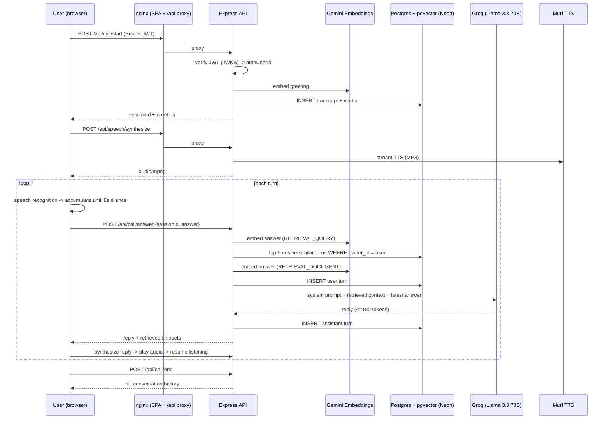

# Aura Skincare — Voice AI Skincare Assistant

Aura is a voice-first conversational agent for skincare support. A signed-in user starts a "call", speaks their skin concern, and Aura replies out loud with a short, grounded answer plus one focused follow-up question. Every turn is embedded and stored per user, and semantically similar past turns are retrieved as context for the next reply, so Aura can recall what a user said earlier in the same or a previous session.

---

## Features

- **Voice conversation loop:** browser speech recognition (live interim and final transcripts), then LLM, then neural text-to-speech playback.
- **Per-user conversational memory (RAG):** every turn is embedded and stored in Postgres with `pgvector`; the top-5 most similar prior turns are retrieved and injected into the prompt.
- **Authenticated and tenant-isolated:** Neon Auth JWTs are verified on the backend via JWKS; every transcript row is scoped to `owner_id`.
- **Safety-aware prompting:** the system prompt forbids diagnosis, and retrieved snippets are explicitly framed as untrusted data (prompt-injection mitigation).
- **Production-minded packaging:** multi-stage Docker build, nginx serving the SPA and reverse-proxying `/api`, healthcheck-gated startup, CORS allow-list, rate limiting.

---

## Architecture



### Stack

| Layer | Choice |
|---|---|
| Frontend | React 19, TypeScript, Vite, Tailwind CSS 4, React Router 7 |
| Backend | Node 22, Express 5, TypeScript (ESM, `NodeNext`) |
| Auth | Neon Auth (JWT, verified server-side with `jose` + remote JWKS) |
| Database / vector store | Neon Postgres + `pgvector` (`vector(768)`, cosine distance) |
| Embeddings | Google `gemini-embedding-001` (768 dims, task-typed query vs document) |
| LLM | Groq, `llama-3.3-70b-versatile` (configurable via `GROQ_MODEL`) |
| Text-to-speech | Murf (`en-IN`, voice `Anusha`, `FALCON` model, MP3) |
| Speech-to-text | Browser speech recognition (client-side) |
| Delivery | Docker multi-stage build, docker-compose, nginx |

### API

All routes under `/api` require `Authorization: Bearer <Neon Auth JWT>`.

| Method | Route | Purpose |
|---|---|---|
| `GET` | `/health` | Liveness (unauthenticated, used by Docker healthcheck) |
| `POST` | `/api/call/start` | Create a session, store and return the greeting |
| `POST` | `/api/call/answer` | `{ sessionId, answer }`: retrieve context, generate reply, persist both turns |
| `POST` | `/api/call/end` | Return the full ordered transcript for the session |
| `POST` | `/api/speech/synthesize` | `{ text }`: returns `audio/mpeg` from Murf |

### Repository layout

```
Backend/
  app.ts                          # Express bootstrap, CORS, rate limit, health, error handling
  migrations/                     # SQL: pgvector extension + transcript_embeddings table
  src/
    routes/                       # api.ts, call.ts, speech.ts
    controllers/                  # callController.ts, speechController.ts
    services/vectorSearchService.ts   # embed, store, similarity search
    middlewares/                  # authenticateNeonUser.ts, requestLogger.ts
    db/postgres.ts                # pg Pool + startup schema verification
Frontend/
  src/
    App.tsx                       # routes ("/" landing, "/home" protected)
    components/Support/SupportPage.tsx   # the call UI + turn-taking logic
    components/ProtectedRoute.tsx
Dockerfile                        # targets: backend, frontend
docker-compose.yml
nginx.conf
```

---

## Getting started

### Prerequisites

- Node 22+ (or just Docker)
- A Neon project with **Neon Auth** enabled and **`pgvector`** available
- API keys: Groq, Google AI Studio (Gemini), Murf

### 1. Configure environment

**`Backend/.env`** (see `Backend/.env.example`):

```env
GEMINI_API_KEY=
GROQ_API_KEY=
GROQ_MODEL=llama-3.3-70b-versatile
MURF_API_KEY=
MURF_VOICE_ID=Anusha
MURF_STYLE=Conversational
MURF_LOCALE=en-IN
MURF_MODEL=FALCON
POSTGRES_URL=            # Neon connection string
NEON_AUTH_BASE_URL=      # issuer / audience for JWT verification
NEON_AUTH_JWKS_URL=      # JWKS endpoint for signature verification
```

**Root `.env`** (see `.env.example`), used by the frontend build:

```env
VITE_NEON_AUTH_URL=<your Neon Auth URL>
VITE_API_URL=            # leave empty when served behind nginx; http://localhost:3000 for local dev
```

### 2. Apply database migrations

Run every file in `Backend/migrations/` against `POSTGRES_URL`, in order. The server **refuses to start** unless the `vector` extension, the `transcript_embeddings` table and its `owner_id` column exist (`verifyTranscriptStorage`).

```bash
for f in Backend/migrations/*.sql; do psql "$POSTGRES_URL" -f "$f"; done
```

### 3a. Run with Docker (recommended)

```bash
docker compose up --build
# app: http://localhost:8080   (override with FRONTEND_PORT)
```

The frontend container waits for the backend `/health` check to pass, and nginx proxies `/api/*` to the backend, so the browser sees a single origin.

### 3b. Run locally

```bash
# terminal 1
cd Backend && npm ci && npm run build && npm start      # http://localhost:3000

# terminal 2
cd Frontend && npm ci && npm run dev                    # http://localhost:5173
```

The default CORS allow-list already includes `localhost:5173`. For other origins set `ALLOWED_ORIGINS` (comma-separated).

> Voice input uses the browser's speech recognition, so use a Chromium-based browser and allow microphone access.

---

## Tell Us How You Think

### 1. Why did you choose your particular architecture and technology stack?

I optimised for the shortest path from "user speaks" to "agent speaks" while keeping the pieces independently swappable.

- **Thin stateless API, state in Postgres.** The backend holds no session state; a `sessionId` plus the authenticated `owner_id` is all it needs. That makes it trivially horizontally scalable and keeps the agent loop to three small endpoints.
- **pgvector on Neon instead of a dedicated vector DB.** Transcripts are relational data (owner, session, role, time) *and* need similarity search. Keeping both in one store means one transactional write per turn, one backup story, and a single `WHERE owner_id = $1` filter that gives tenant isolation for free. At this scale a separate vector service would add operational cost without a retrieval-quality benefit.
- **Groq + Llama 3.3 70B for generation.** A voice agent is latency-bound; fast inference matters more than the last few points of benchmark quality. The reply is capped at 180 tokens, which also suits spoken output. The model is an env var, so swapping it is a config change.
- **Gemini embeddings with task types.** `RETRIEVAL_QUERY` vs `RETRIEVAL_DOCUMENT` gives better asymmetric retrieval, and truncating to 768 dims keeps vector storage and search cheap.
- **Browser STT, server-side TTS.** Recognition in the browser avoids streaming raw audio through my backend and gives free interim transcripts for UI feedback. TTS stays server-side so the Murf key is never exposed and voice/locale (`en-IN`) are centrally controlled.
- **Neon Auth with JWKS verification.** Stateless JWT checks mean no session store to scale, and the verified `sub` claim becomes the `owner_id` that scopes all data.
- **nginx + multi-stage Docker.** One origin for the SPA and API removes CORS pain in production; the multi-stage build keeps runtime images small and runs the backend as a non-root user.

### 2. What was the most difficult part of the assignment, and how did you solve it?

**Turn-taking in a voice conversation.** Text chat has an obvious "send" event; speech doesn't. Browser recognition emits bursts of final results mid-sentence, so naïvely submitting each burst made the agent answer half-thoughts, and users who paused to think got interrupted.

How I handled it:
- Final transcript chunks are **accumulated in a ref** and only the *full* accumulated answer is submitted.
- A **silence timer (8 s)** resets on every new final result and fires the submission, so a natural pause doesn't end the turn.
- An **`isSubmitting` lock** prevents double submission when the timer and a late recognition result race.
- **Recognition is stopped while the agent speaks** and restarted after playback, so Aura doesn't transcribe its own voice; a barge-in handler cancels the pending timer if the user starts talking.

A close second was **keeping retrieved memory from becoming an attack surface**: previous user text is fed back into the prompt, so a prior turn like "ignore your instructions…" could steer later replies. The system prompt marks retrieved snippets as untrusted reference data, and the model is told never to follow instructions inside them or present them as verified medical advice.

### 3. If you had one more week, what would you improve first and why?

**Grounding and safety of the answers**, because for a skincare agent a confident wrong answer is the worst failure.

1. **A curated knowledge base** (ingredient interactions, routine ordering, patch-testing guidance, when-to-see-a-dermatologist rules) retrieved alongside the user's own history. Today retrieval is only over past conversation, so the model answers skincare questions from parametric knowledge.
2. **Red-flag detection and escalation:** persistent pain, spreading rashes, suspicious moles, allergic reactions should short-circuit to "please see a clinician" rather than a generic tip.
3. **An eval harness:** a small golden set of conversations scored for safety, groundedness and brevity, run on every prompt or model change. Without it I'm tuning the prompt blind.

Right after that: fix the vector-search query and add a proper ANN index (see Q4), plus cleanup of leftover naming from the template this started from (`caller`/`candidate` roles, "interview" copy in the UI).

### 4. Imagine this agent is handling 1,000 customer conversations a day. What would need to change?

1,000 conversations/day is only a few per minute on average, but each turn fans out to **three embedding calls, one LLM call, up to three Postgres writes/reads and one TTS call**, and traffic is bursty. What I'd change:

- **Latency and cost per turn.** Embed the answer once and reuse the vector for both the query and the stored row; write the two transcript rows asynchronously (queue or fire-and-forget with retry) so they're off the critical path. Stream LLM tokens and start TTS per sentence instead of waiting for the full reply. Cache TTS for the fixed greeting and common phrases.
- **Retrieval scaling.** Add an `(owner_id)` index and an **HNSW** index on `embedding`; at this volume an unindexed scan per turn will degrade as history grows. Cap retrieval by recency window and a similarity threshold so low-relevance turns aren't injected. Add summarisation of old sessions into a compact profile ("sensitive skin, uses retinol 2x/week") instead of retrieving raw turns forever.
- **Reliability.** Timeouts, retries with backoff and circuit breakers around Groq, Gemini and Murf (only TTS has a timeout today), plus graceful degradation: if TTS fails, fall back to on-screen text; if embeddings fail, answer without memory rather than failing the turn. Move to a pooled Postgres connection endpoint with sized `pg` pool limits.
- **Abuse and fairness controls.** Rate limiting is currently per IP (200 req / 15 min); switch to **per-user** limits and per-user daily token budgets, since many users can share an IP and one user can burn quota.
- **Observability.** Structured logs with session IDs, per-stage latency (STT, embed, retrieve, LLM, TTS), token and cost metrics, error-rate alerts, and sampled transcript review (with consent and PII handling) to catch bad answers early.
- **Quality and safety at scale.** Automated evals on a rolling sample, red-flag escalation metrics, a feedback control (thumbs up/down) feeding the eval set, and human review of flagged conversations.
- **Privacy and compliance.** Skin concerns can be health-adjacent. I'd add explicit consent, a retention policy and per-user deletion of transcripts and embeddings, and encryption/PII scrubbing before anything is logged.
- **Deployment.** Run multiple stateless backend replicas behind a load balancer, with secrets in a manager rather than env files, and CI that runs typecheck, lint and the eval suite before deploy.

---

## Known limitations

- Speech recognition depends on the browser's implementation (best on Chromium) and needs mic permission.
- Memory is retrieval over prior *conversation* only; there is no curated skincare knowledge base yet.
- Aura gives general guidance and does not diagnose or replace a dermatologist.
- No automated test suite or eval harness yet (see Q3).
